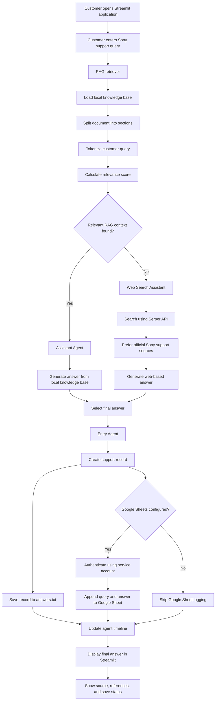
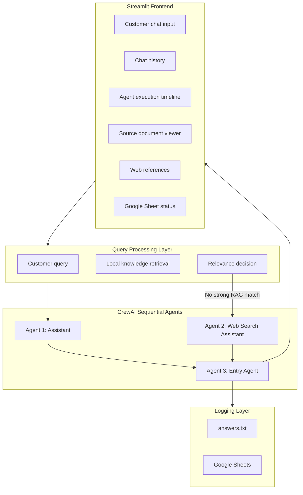
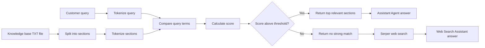
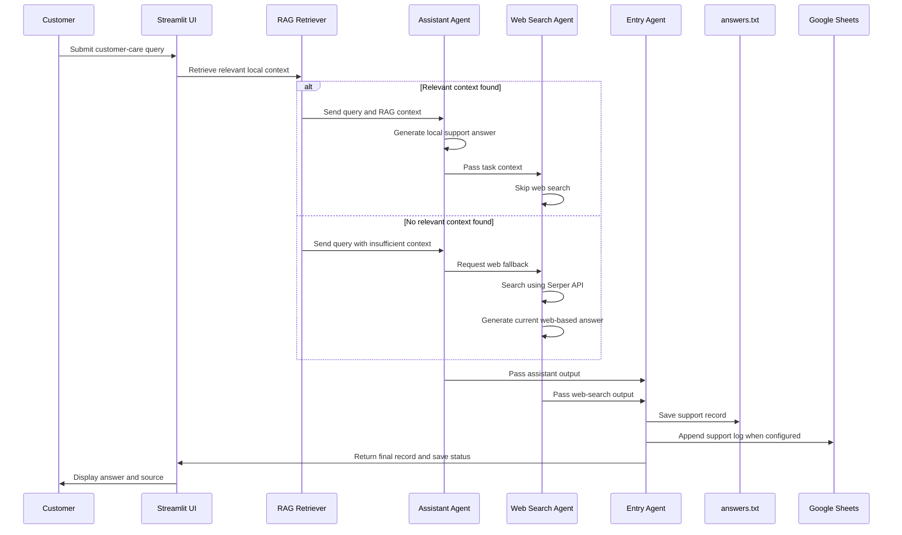
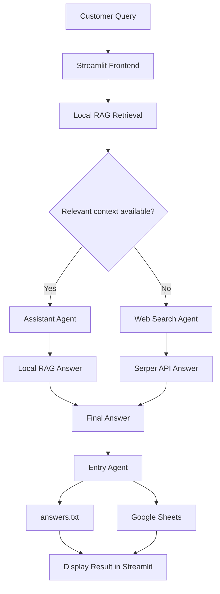

# Sony Customer Care CrewAI RAG App

This project is a Streamlit customer-support application built with CrewAI. It
answers Sony support questions using a local RAG document first and uses web
search only when the local document does not contain a strong match.

The app includes a polished Streamlit frontend, a sequential multi-agent CrewAI
backend, local text logging, optional Google Sheet logging, and a source
document viewer for transparency.

## Key Features

- Beautiful Streamlit UI with glassmorphism styling
- Animated gradient background
- Chat-style customer support interface
- Chat history during the session
- RAG-first answer flow
- Web search fallback using Serper
- CrewAI sequential agent execution
- Agent execution timeline
- Agent status panel
- Source document viewer
- Web search references tab
- Local support log saved to `answers.txt`
- Optional Google Sheet logging
- API keys loaded from `.env`

## Project Structure

```text
sony-customer-care-crewai/
|-- app.py
|-- requirements.txt
|-- sony_customer_care_rag_document.txt
|-- .env.example
|-- .gitignore
|-- README.md
```

## Tech Stack

| Layer | Tool |
| --- | --- |
| Frontend | Streamlit |
| Agent framework | CrewAI |
| LLM | OpenAI |
| Web search | Serper API |
| Local knowledge base | Text document |
| Environment variables | python-dotenv |
| Cloud logging | Google Sheets with gspread |

## Agent Roles

| Agent | Role |
| --- | --- |
| Assistant | Answers from the local Sony customer-care RAG context |
| Web Search Assistant | Uses Serper only when local RAG does not have a strong match |
| Entry Agent | Saves the query, answer source, final answer, and status |

## System Flow



## Multi-Agent Architecture



## RAG Decision Architecture



The matcher ignores generic words such as `sony`, `customer`, `care`, and
`support`. This prevents unrelated questions like "when Sony started" from
being incorrectly answered from the local support document.

## CrewAI Sequential Workflow



## Simple End-to-End Flow



## Setup

Create and activate a virtual environment.

```powershell
python -m venv venv
venv\Scripts\Activate.ps1
```

Install dependencies.

```powershell
pip install -r requirements.txt
```

## Environment Variables

Create a `.env` file in the same folder as `app.py`.

```env
OPENAI_API_KEY=your-openai-key
SERPER_API_KEY=your-serper-key
OPENAI_MODEL_NAME=gpt-4o-mini

GOOGLE_SHEET_ID=your-google-sheet-id
GOOGLE_APPLICATION_CREDENTIALS=service-account.json
GOOGLE_WORKSHEET_NAME=CrewAI Logs
```

`SERPER_API_KEY` is required only when the app needs web search fallback.

## Google Sheet Setup

1. Create a Google Cloud service account.
2. Enable the Google Sheets API.
3. Download the service-account JSON key.
4. Save it beside `app.py` as `service-account.json`, or use an absolute path in
   `GOOGLE_APPLICATION_CREDENTIALS`.
5. Open the JSON file and copy the service-account email.
6. Share your Google Sheet with that email as an editor.
7. Put the spreadsheet ID in `GOOGLE_SHEET_ID`.
8. Run `pip install -r requirements.txt` so `gspread` is installed.

The app creates the worksheet automatically if it does not exist.

## Run The App

```powershell
streamlit run app.py
```

The application opens in the browser at:

```text
http://localhost:8501
```

## Example Queries

Use local RAG:

```text
What is the Sony customer care number?
How do I track my Sony repair status?
How can I book Sony TV service?
```

Use web fallback:

```text
When was Sony started?
Who is the current CEO of Sony?
What is Sony's latest camera launch?
```

## Output Logs

The app saves a local log to:

```text
answers.txt
```

When Google Sheets is configured, the app also appends:

- Timestamp
- Query
- Answer source
- Final answer
- Web status
- References
- Entry record
- Model name

## Troubleshooting

If Google Sheet logging says `No module named 'gspread'`, install dependencies:

```powershell
pip install -r requirements.txt
```

If Google Sheet logging says credentials are missing, check:

- `GOOGLE_APPLICATION_CREDENTIALS` points to the correct JSON file.
- The JSON file exists beside `app.py` or at the absolute path you provided.
- Your Google Sheet is shared with the service-account email.

If a general Sony history/current-events question uses local RAG, add its
generic words to the `STOPWORDS` set or raise the RAG `min_score` threshold in
`retrieve_rag_context`.

## Security Notes

- Do not commit `.env`.
- Do not commit `service-account.json`.
- Do not commit `answers.txt` if it contains customer queries or API output.
- Keep `OPENAI_API_KEY`, `SERPER_API_KEY`, and Google credentials private.
